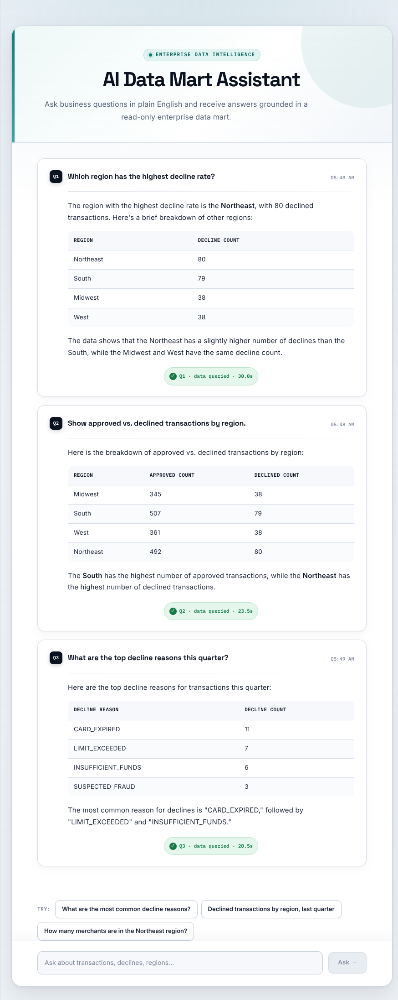
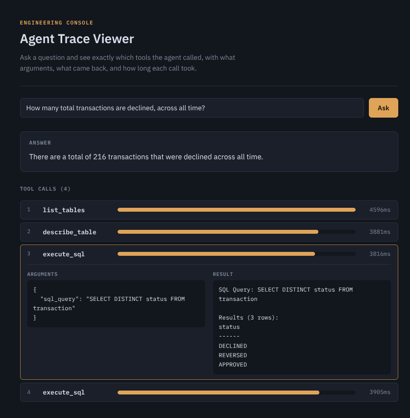

# agentic-analytics

[](https://github.com/pramalin/agentic-analytics/actions/workflows/e2e-test.yml)

A natural-language analytics agent built with Spring AI: ask a plain-English
question, the agent queries a Postgres data mart through tools exposed over
a real MCP (Model Context Protocol) gateway, and returns an answer.

Built as a portfolio project — Spring Boot 4 / Spring AI 2.0 backend, a
React frontend, three swappable model providers (Anthropic, OpenAI, and
fully local options), and a Docker Compose setup for local dev.



## What's here

- **Agent** — Spring AI `ChatClient`, tool-calling over MCP, conversation memory
- **Tools** — a real Docker MCP Gateway in front of a third-party Postgres tool
  server, connecting as a genuinely read-only DB role (enforced by Postgres
  itself, not application code)
- **Models** — swap providers per `docker compose` overlay: Anthropic (Claude),
  OpenAI (cloud), or fully local (Docker Model Runner / Ollama), no code changes
- **RAG** — schema-doc grounding via pgvector; built and tested, currently
  **disabled** after it was found to break multi-turn tool-calling — see
  [`docs/rag.md`](docs/rag.md) for the full story
- **Frontend** — React + TypeScript, markdown-rendered answers (real tables,
  not text blobs)
- **Engineering console** — Angular, at port 4200: the same agent, but shows
  the actual tool calls (name, arguments, result, timing) behind each
  answer, not just the final text — built for developers, not end users



This was built step by step with a documented debugging trail — real bugs
found through testing, not just a demo that happens to work once. The full
history, including the things that didn't work the first time, is in
[`docs/development-log.md`](docs/development-log.md).

## Running this

Three ways to run it, depending on what you want:

### Option A — fully local, no API key, no cloud cost, model starts automatically (Docker Model Runner)

The recommended local option. Just Docker — nothing to sign up for, pay
for, or start manually in another terminal.

```bash
docker compose down -v --remove-orphans
docker compose -f compose.yaml -f compose.docker-model-runner.yaml up --build
```

Needs Docker Model Runner support on your machine — check first with
`docker model version`. If that's not a recognized command, use Option A2
below instead.

First run pulls the model automatically as part of `docker compose up` (no
`docker model run` or `ollama serve` left running separately) — several
minutes depending on your connection. Slower to respond than a cloud model,
especially without a GPU; that's expected.

### Option A2 — fully local fallback, no API key (plain Ollama container)

Use this if `docker model version` isn't available on your machine.

```bash
docker compose down -v --remove-orphans
docker compose -f compose.yaml -f compose.ollama.yaml up --build
```

Same idea as Option A, minus Compose's native model management — Ollama
runs as an ordinary container instead.

### Option B — Anthropic (Claude)

Requires an API key from **console.anthropic.com** — a separate account and
billing from a Claude Pro/Max subscription; Pro doesn't include API access.

```bash
cp .env.example .env
# edit .env, set ANTHROPIC_API_KEY

docker compose down -v --remove-orphans
docker compose -f compose.yaml -f compose.anthropic.yaml up --build
```

### Option C — OpenAI (cloud, more capable than the local options)

Requires an API key from **platform.openai.com** — same separation as
above: a ChatGPT Plus/Pro subscription is not the same account or billing
as API access.

```bash
cp .env.example .env
# edit .env, set OPENAI_API_KEY

docker compose down -v --remove-orphans
docker compose -f compose.yaml -f compose.openai.yaml up --build
```

### Option D — llmsim (deterministic, for testing — not for actual use)

No API key, no cloud cost, no real model at all — a small, scripted
stand-in ([llmsim](https://github.com/pramalin/llmsim)) that answers the
exact wire protocol Spring AI expects, so the agent can't tell the
difference, but with the model's behavior fully scripted instead of
inferred. Useful for CI and local development when hitting a real
provider on every run is undesirable (cost, latency, nondeterminism) or
outright unavailable (no API key configured, no network access) — not a
way to actually use the assistant, since it only ever answers the one
scripted question in `llmsim/AnalyticsFlow.scala`.

```bash
docker compose down -v --remove-orphans
docker compose -f compose.yaml -f compose.llmsim.yaml up --build
```

The script mirrors this app's actual required tool-calling sequence —
`list_tables` → `describe_table` → `execute_sql` → a final reply built
from execute_sql's real result — so it still exercises the full real MCP
round trip (real Postgres data mart, real `mcp-gateway`) with only "what
the model decides to do" held fixed.

### Whichever option, once it's up

```bash
curl http://localhost:8080/api/info
curl http://localhost:8080/actuator/health

curl -X POST localhost:8080/api/questions \
  -H "Content-Type: application/json" \
  -d '{"question": "What were declined transactions by region last quarter?"}'
```

Or use the actual UI: **http://localhost:3000**. For the engineering
console (shows real tool calls, arguments, results, and timing behind each
answer — built for developers, not end users): **http://localhost:4200**.

If the agent responds but says it has no tools available, the MCP gateway
likely isn't wired up correctly on your machine yet — see
[`docs/mcp-gateway.md`](docs/mcp-gateway.md) for the most probable cause and
how to check it.

### Faster local iteration

Backend only (no MCP gateway, no frontend) — useful for working on the
REST/data-mart layer, not for exercising the agent:
```bash
docker compose up postgres
cd application
OPENAI_API_KEY=sk-... mvn spring-boot:run
# or, to skip needing any key:
SPRING_PROFILES_ACTIVE=docker-model-runner mvn spring-boot:run
```

Frontend only, with hot reload (needs the backend running separately):
```bash
cd frontend-react
npm install
npm run dev   # http://localhost:3000
```

Engineering console only, with hot reload (needs the backend running
separately; if the Docker-served version is already up, `docker compose
stop frontend-angular` first to free port 4200):
```bash
cd frontend-angular
npm install
ng serve   # http://localhost:4200
```

## Testing

Unit and integration tests (Docker must be running — several test classes
spin up their own Postgres container via Testcontainers; no real API key
or MCP gateway needed, all disabled/placeholder'd for the full-context
tests):
```bash
cd application && mvn test
```

End-to-end regression test — brings up the *real* stack (real Postgres,
real `mcp-gateway`, real Spring AI) with [llmsim](https://github.com/pramalin/llmsim)
standing in for the model provider (see Option D above), asks the agent
a question, and asserts on both the final answer and the full tool-call
trace (`list_tables` → `describe_table` → `execute_sql`, in order, with
the right arguments) — not just "did it answer something":
```bash
./scripts/e2e-test.sh
```
Runs automatically in CI on every push to `main` and every PR
(`.github/workflows/e2e-test.yml`) — the badge at the top of this README
reflects its current status. It tears the whole stack down on exit, pass
or fail, so it never leaves containers running behind it.

## Docs

- [`docs/llmsim-agentic-analytics-guide.md`](docs/llmsim-agentic-analytics-guide.md) —
  deterministic testing with llmsim: how the pattern works, and a
  step-by-step guide to adding it to another Spring AI application.
- [`docs/development-log.md`](docs/development-log.md) — the full
  step-by-step build history: what got built, what broke, how it was
  found, and why specific decisions were made.
- [`docs/mcp-gateway.md`](docs/mcp-gateway.md) — why tools moved to the MCP
  gateway, what's verified vs. inferred, and troubleshooting steps.
- [`docs/rag.md`](docs/rag.md) — why schema-doc RAG exists, how it works,
  and why it's currently disabled.

## Repo layout

```
agentic-analytics/
├── compose.yaml               # base: postgres, mcp-gateway, application, frontend-react, frontend-angular
├── compose.anthropic.yaml     # provider overlay: Anthropic API key/model
├── compose.docker-model-runner.yaml  # provider overlay: local, auto-started model
├── compose.llmsim.yaml        # provider overlay: scripted, deterministic stand-in — no API key, no real model
├── compose.ollama.yaml        # provider overlay: local Ollama fallback, no API key
├── compose.openai.yaml        # provider overlay: real OpenAI cloud API key/model
├── mcp-config.yaml            # MCP gateway's database-server connection config
├── llmsim/                    # scripted provider for compose.llmsim.yaml — see Option D above
│   ├── AnalyticsFlow.scala    # scripts the agent's real tool-call sequence
│   └── Dockerfile             # layers AnalyticsFlow.scala on the published llmsim engine
├── scripts/
│   └── e2e-test.sh            # end-to-end regression test, see "Testing" above
├── .github/
│   └── workflows/
│       └── e2e-test.yml       # runs scripts/e2e-test.sh on every push/PR
├── .env.example
├── README.md
├── docs/
│   ├── llmsim-agentic-analytics-guide.md
│   ├── development-log.md
│   ├── mcp-gateway.md
│   ├── rag.md
│   └── images/
│       ├── screenshot.png
│       └── console-screenshot.png
├── talk/                      # JaxJUG talk slides + LinkedIn post drafts
├── frontend-react/
│   ├── Dockerfile
│   ├── nginx.conf
│   ├── package.json
│   └── src/
│       ├── main.tsx
│       ├── App.tsx
│       ├── App.css
│       └── api.ts
├── frontend-angular/           # engineering console (Step 9) — developers only
│   ├── Dockerfile
│   ├── nginx.conf
│   ├── package.json
│   └── src/
│       ├── styles.css          # global styles — CSS custom properties MUST
│       │                       # live here, not in app.css (see Step 9's
│       │                       # entry in development-log.md for why)
│       └── app/
│           ├── app.ts
│           ├── app.html
│           ├── app.css
│           └── question.service.ts
└── application/
    ├── Dockerfile
    ├── pom.xml
    └── src/
        ├── main/java/com/example/agenticanalytics/
        │   ├── AgenticAnalyticsApplication.java
        │   ├── web/
        │   │   ├── ApplicationInfoController.java
        │   │   └── QuestionController.java
        │   ├── config/ChatClientConfig.java
        │   ├── rag/SchemaDocIngestor.java
        │   └── tracing/                # tool-call trace capture (Step 8)
        │       ├── ToolCallTrace.java
        │       ├── ToolCallTraceCollector.java
        │       └── TracingToolCallback.java
        ├── main/resources/
        │   ├── application.yml
        │   ├── application-docker-model-runner.yml
        │   ├── db-init/01_init_datamart.sql
        │   └── schema-docs/
        │       ├── transaction.md
        │       └── merchant_and_region.md
        └── test/java/com/example/agenticanalytics/
            ├── AgenticAnalyticsApplicationTests.java
            ├── web/QuestionControllerTest.java
            ├── rag/SchemaDocIngestorIT.java
            └── seed/SeedDataIT.java
```
