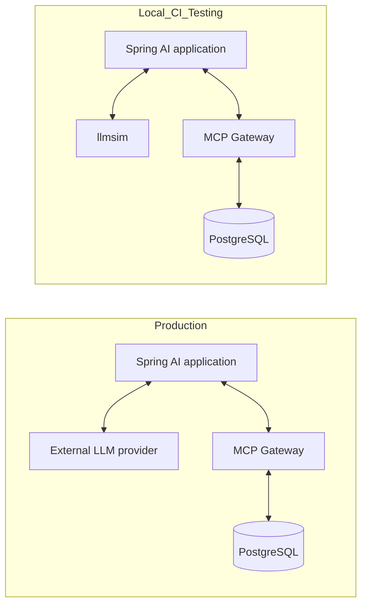
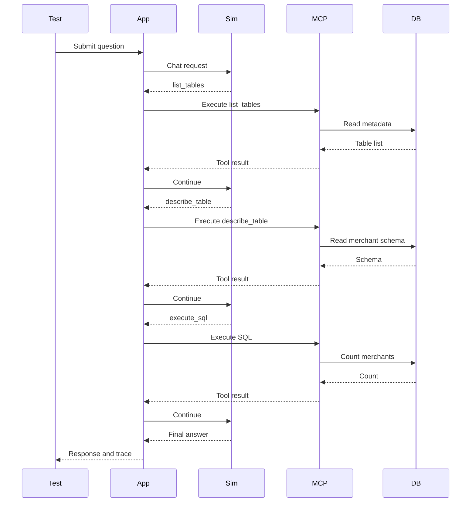

# Deterministic Testing for Agentic AI with llmsim

`agentic-analytics` demonstrates a practical testing pattern for enterprise AI applications:

> Replace only the external language model with a deterministic simulator, while keeping Spring AI, MCP Gateway, PostgreSQL, tool execution, HTTP calls, and the application code real.

The companion project, [`llmsim`](https://github.com/pramalin/llmsim), provides the simulator. This repository shows how to use it in a real Spring AI application.

---

## Why deterministic AI testing matters

Agentic applications are harder to regression test than traditional request-response services. A typical flow may involve:

- a user question,
- an LLM deciding which tool to call,
- tool arguments generated by the model,
- MCP tool execution,
- SQL execution,
- tool results returned to the model,
- and a final answer.

When a real external model is involved, a regression test may fail because of model variation, latency, network availability, prompt sensitivity, API cost, or provider changes.

For CI and repeatable local testing, we often want a narrower question:

> Did the application still perform the expected agentic workflow?

`llmsim` helps answer that question by scripting the model's decisions deterministically.

---

## Core idea

In production, the application talks to a real OpenAI-compatible provider. In deterministic testing, Spring AI is pointed at `llmsim` instead.



Only the model endpoint changes. The rest of the system remains real.

---

## How agentic-analytics uses llmsim

`agentic-analytics` asks analytics questions through a Spring Boot API. The application uses Spring AI and MCP tools to query a PostgreSQL data mart.

For deterministic testing, this repository adds a provider overlay:

```text
compose.llmsim.yaml
```

That overlay starts an `llmsim` container and points Spring AI's OpenAI base URL to it:

```yaml
services:
  llmsim:
    build: ./llmsim
    ports:
      - "8089:8089"

  application:
    environment:
      - AI_MODEL_CHAT=openai
      - OPENAI_API_KEY=unused
      - OPENAI_MODEL_NAME=gpt-4o
      - SPRING_AI_OPENAI_BASE_URL=http://llmsim:8089/v1
    depends_on:
      llmsim:
        condition: service_started
```

The API key is unused because `llmsim` does not call a real provider.

---

## Tool-calling flow

The current `agentic-analytics` simulation answers the question:

```text
How many merchants do we have?
```

The scripted model behavior follows the same tool sequence expected from the real application:

1. `list_tables`
2. `describe_table` for the `merchant` table
3. `execute_sql` with `select count(*) from merchant`
4. final answer based on the real tool result



The database query and MCP tool execution are real. The model's decisions are the scripted part.

---

# Developer setup guide

This section describes how to add `llmsim` to another project, using `agentic-analytics` as the working example.

## 1. Add a project-owned llmsim folder

In the consuming application, add a folder for the simulator script:

```text
agentic-analytics/
└── llmsim/
    ├── Dockerfile
    └── AnalyticsFlow.scala
```

The application owns the script because the expected tool behavior is application-specific.

Do not copy the full `llmsim` source code into the application repository.

---

## 2. Create an application-specific simulation script

In `agentic-analytics`, the script lives in:

```text
llmsim/AnalyticsFlow.scala
```

The important part is the `Script.exactly(...)` sequence:

```scala
package com.example.agenticanalytics.llmsim

import com.alai.llmsim.{Script, ScriptSource}
import com.alai.llmsim.Script._
import io.circe.parser.parse

object AnalyticsFlow extends ScriptSource {

  private def lastValue(mcpResult: String): String = {
    val text = parse(mcpResult).toOption
      .flatMap(_.asArray)
      .flatMap(_.headOption)
      .flatMap(_.asObject)
      .flatMap(_("text"))
      .flatMap(_.asString)
      .getOrElse(mcpResult)

    text.split("\n").map(_.trim).filter(_.nonEmpty).lastOption.getOrElse(text.trim)
  }

  val script: Script = Script.exactly(
    toolCall(id = "call-1", name = "list_tables", arguments = "{}"),
    toolCall(id = "call-2", name = "describe_table", arguments = """{"table_name":"merchant"}"""),
    toolCall(id = "call-3", name = "execute_sql", arguments = """{"sql_query":"select count(*) from merchant"}"""),
    replyFromToolResult("call-3")(result => s"There are ${lastValue(result)} merchants.")
  )
}
```

This script says:

- when the application asks the model for a response, request `list_tables`,
- then request `describe_table`,
- then request `execute_sql`,
- then build the final answer from the actual result returned by the tool.

The simulator does not need a real LLM. It simply behaves like one for the specific test scenario.

---

## 3. Build the simulator image from the published llmsim build image

The consuming application uses the published `llmsim-build` image as a build base.

`agentic-analytics/llmsim/Dockerfile`:

```dockerfile
FROM ghcr.io/pramalin/llmsim-build:0.1.0 AS build

COPY AnalyticsFlow.scala /build/src/main/scala/com/example/agenticanalytics/llmsim/AnalyticsFlow.scala
RUN sbt assembly

FROM eclipse-temurin:21-jre-jammy

COPY --from=build /build/target/scala-3.3.3/llmsim.jar /app/llmsim.jar

ENV LLMSIM_SCRIPT=com.example.agenticanalytics.llmsim.AnalyticsFlow

EXPOSE 8089

ENTRYPOINT ["java", "-jar", "/app/llmsim.jar"]
```

This pattern keeps responsibilities clean:

- `llmsim` supplies the reusable simulator engine.
- the application supplies only its scripted behavior.
- the final image runs the simulator with the application-specific script.

Pin the image version in real projects. Avoid relying on `latest` in CI.

---

## 4. Add a Docker Compose provider overlay

Add a provider overlay similar to:

```text
compose.llmsim.yaml
```

Example:

```yaml
services:
  llmsim:
    build: ./llmsim
    ports:
      - "8089:8089"

  application:
    environment:
      - AI_MODEL_CHAT=openai
      - OPENAI_API_KEY=unused
      - OPENAI_MODEL_NAME=gpt-4o
      - SPRING_AI_OPENAI_BASE_URL=http://llmsim:8089/v1
    depends_on:
      llmsim:
        condition: service_started
```

The key setting is:

```text
SPRING_AI_OPENAI_BASE_URL=http://llmsim:8089/v1
```

That causes Spring AI's normal OpenAI-compatible client to call `llmsim` instead of a real cloud provider.

---

## 5. Run locally

From the repository root:

```bash
docker compose down -v --remove-orphans
docker compose -f compose.yaml -f compose.llmsim.yaml up --build
```

Then call the application:

```bash
curl -X POST http://localhost:8080/api/questions \
  -H "Content-Type: application/json" \
  -d '{"question":"How many merchants do we have?"}'
```

Expected result:

```text
There are 6 merchants.
```

The exact response envelope depends on the application API, but the final answer should reflect the real database result returned by the tool.

---

## 6. Inspect the llmsim call journal

`llmsim` exposes a call journal that can be useful during debugging and regression tests.

```bash
curl http://localhost:8089/_llmsim/calls
```

Use this to confirm that the application really communicated with the simulator using the expected OpenAI-compatible protocol.

---

## 7. Add an end-to-end regression test

A useful regression test should validate more than the final answer.

For `agentic-analytics`, the test should verify:

- the final answer,
- tool-call count,
- tool-call order,
- tool names,
- tool arguments,
- generated SQL,
- and optionally the `llmsim` call journal.

A high-value assertion set looks like this:

```text
Expected tool order:
1. list_tables
2. describe_table
3. execute_sql

Expected describe_table argument:
merchant

Expected execute_sql argument:
select count(*) from merchant

Expected final answer:
There are 6 merchants.
```

This detects regressions in tool discovery, serialization, MCP wiring, SQL generation, tool-result handling, and final-response construction.

---

## 8. GitHub Actions pattern

A CI workflow can run the same stack:

```yaml
name: llmsim e2e

on:
  push:
  pull_request:

jobs:
  e2e:
    runs-on: ubuntu-latest

    steps:
      - uses: actions/checkout@v4

      - name: Start deterministic stack
        run: |
          docker compose down -v --remove-orphans || true
          docker compose -f compose.yaml -f compose.llmsim.yaml up --build -d

      - name: Wait for application
        run: |
          for i in {1..60}; do
            if curl -fsS http://localhost:8080/actuator/health >/dev/null; then
              exit 0
            fi
            sleep 2
          done
          docker compose -f compose.yaml -f compose.llmsim.yaml logs --no-color
          exit 1

      - name: Run deterministic question
        run: |
          curl -fsS -X POST http://localhost:8080/api/questions \
            -H "Content-Type: application/json" \
            -d '{"question":"How many merchants do we have?"}'

      - name: Show llmsim journal
        if: always()
        run: |
          curl -s http://localhost:8089/_llmsim/calls || true

      - name: Stop stack
        if: always()
        run: |
          docker compose -f compose.yaml -f compose.llmsim.yaml down -v --remove-orphans
```

In a production-grade workflow, put the actual assertions in a shell script or test runner rather than only printing the response.

---

## 9. Recommended diagnostics

When CI fails, capture the full Compose state and logs:

```bash
docker compose -f compose.yaml -f compose.llmsim.yaml ps -a
docker compose -f compose.yaml -f compose.llmsim.yaml logs --no-color application
docker compose -f compose.yaml -f compose.llmsim.yaml logs --no-color llmsim
docker compose -f compose.yaml -f compose.llmsim.yaml logs --no-color mcp-gateway
```

For GitHub Actions, upload logs as artifacts on failure.

---

## 10. How to adapt this pattern to another application

For a new project:

1. Identify one high-value business question.
2. Run it once with a real model and observe the expected tool sequence.
3. Write a project-owned `ScriptSource` that reproduces that sequence.
4. Add a small `llmsim/Dockerfile` based on `ghcr.io/pramalin/llmsim-build:<version>`.
5. Add a Compose overlay that points the application's OpenAI-compatible client to `llmsim`.
6. Add an end-to-end test that verifies final output and internal tool behavior.
7. Run the same test locally and in CI.

Start with one deterministic scenario. Add more scripts only when they protect meaningful application behavior.

---

## What llmsim is not

`llmsim` is not intended to replace a real LLM for product usage.

It is also not a general intelligence emulator.

It is a deterministic simulation engine for testing known AI workflows.

That makes it especially useful for:

- local development,
- CI regression tests,
- provider-independent testing,
- offline testing,
- cost-free test runs,
- and repeatable debugging of tool-calling flows.

---

## Roadmap ideas

Useful next capabilities include:

- streaming response simulation,
- latency injection,
- transient provider failures,
- multiple scripted scenarios,
- multi-agent flows,
- richer call-journal assertions,
- and reusable testing helpers for Spring AI applications.

---

## Summary

`llmsim` and `agentic-analytics` together show a practical engineering pattern:

> Treat the LLM as a replaceable provider during testing, but keep the rest of the agentic system real.

This gives developers deterministic regression tests without sacrificing the integration coverage that makes end-to-end tests valuable.
