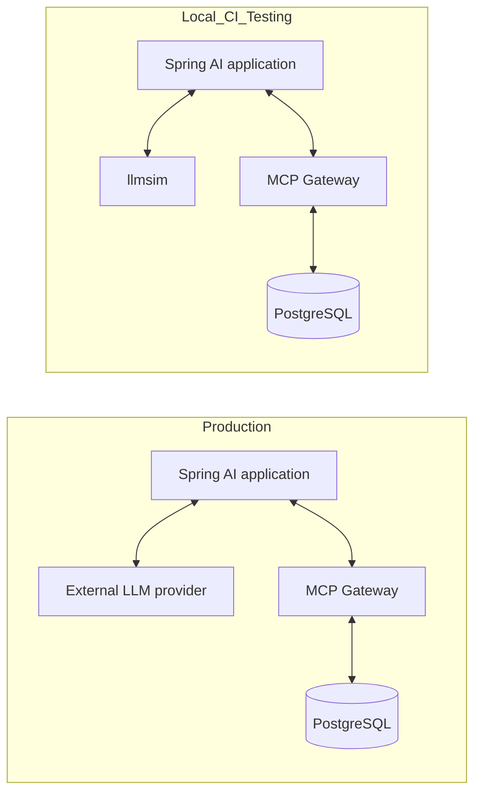
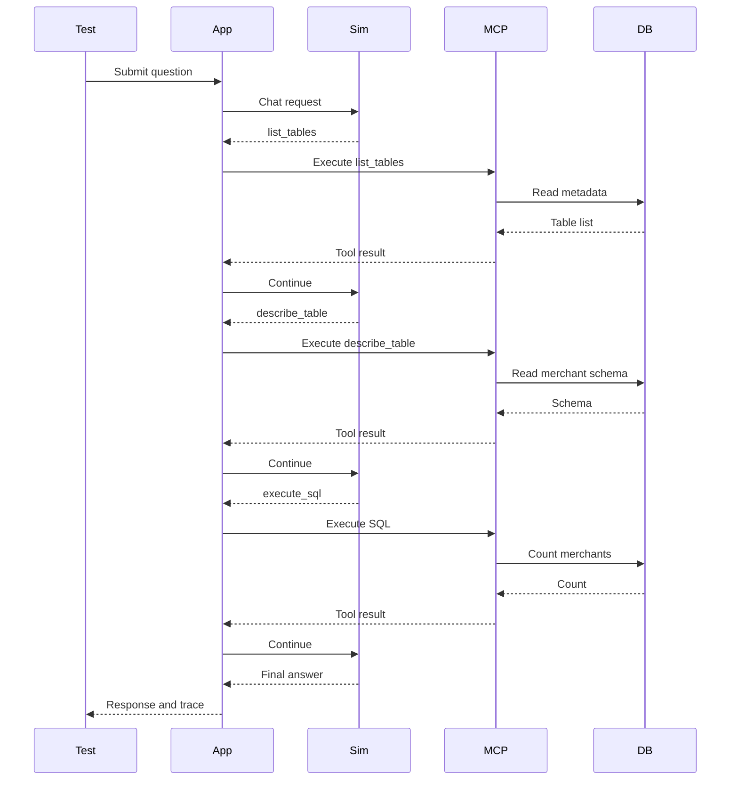

# Deterministic Regression Testing for a Real Spring AI Application

`agentic-analytics` is a complete Spring AI application: a natural-language
analytics agent that answers plain-English questions by querying a
Postgres data mart through real tools exposed over MCP (Model Context
Protocol). It's also something most AI application examples aren't —
deterministically end-to-end testable, in CI, with no API key and no live
model provider anywhere in the loop.

That's made possible by [`llmsim`](https://github.com/pramalin/llmsim), a
companion simulator that replaces only the LLM in the request path.
Everything else — Spring AI, the MCP Gateway, PostgreSQL, real tool
execution — stays real.

This guide explains why that distinction matters, then walks through
adding the same pattern to another Spring AI application, using
`agentic-analytics` itself as the working reference.

---

## 1. Why deterministic testing?

Agentic applications are harder to regression test than traditional
request-response services. A typical flow involves:

- a user question,
- an LLM deciding which tool to call,
- tool arguments generated by the model,
- MCP tool execution,
- SQL execution,
- tool results returned to the model,
- and a final answer.

When a real external model is in that loop, a test can fail for reasons
that have nothing to do with an actual regression: model variation,
latency, network availability, prompt sensitivity, API cost, or a
provider-side change.

For CI and repeatable local testing, the question that actually matters
is narrower:

> Did the application still perform the expected agentic workflow?

`agentic-analytics` answers that with a real, working example: its
tool-calling flow is fully covered by an automated end-to-end test that
runs on every push, with zero dependency on a live model provider — see
[`scripts/e2e-test.sh`](../scripts/e2e-test.sh) and
[`.github/workflows/e2e-test.yml`](../.github/workflows/e2e-test.yml).

---

## 2. Architecture

In production, the application talks to a real OpenAI-compatible or
Anthropic-compatible provider. In deterministic testing, Spring AI is
pointed at `llmsim` instead — nothing else in the request path changes.



Only the model endpoint changes. The rest of the system remains real.

### What llmsim is not

llmsim is not intended to replace a real LLM for product usage, and it's
not a general intelligence emulator — it's a deterministic simulation
engine for testing known AI workflows. That's what makes it useful for
local development, CI regression tests, provider-independent testing,
offline testing, cost-free test runs, and repeatable debugging of
tool-calling flows. It has no opinion about whether your application's
answers are *good* — that's still your test's job, using the evidence
llmsim and your application both expose (see section 9).

### Why replace only the LLM?

Mocking the Spring AI client directly would make individual tests fast,
but it bypasses the HTTP boundary entirely — it can't catch a
misconfigured endpoint, a malformed message payload, an incompatible
tool definition, a tool-call serialization bug, or something a Spring AI
upgrade changed underneath you. llmsim sits across that same boundary a
real provider would, so it still exercises all of that.

Mocking the tools themselves would cost even more here, since the MCP
Gateway → PostgreSQL path is central to what `agentic-analytics` actually
does. Keeping it real verifies that tools are discovered, arguments
serialize correctly, the gateway routes the request, the schema is
available, SQL executes, and results come back in the shape Spring AI
expects — none of which a tool mock would catch.

### When llmsim fits, and when it doesn't

llmsim is well suited to stable regression paths: known tool-calling
workflows, prompt and configuration changes, Spring AI upgrades,
tool-schema changes, SQL-generation contracts, error-handling paths, and
CI smoke tests. A real model is still the right tool for exploratory
evaluation, language quality, novel user requests, broad reasoning
behavior, model comparisons, and production acceptance testing.

A practical strategy layers both: unit tests for business logic,
deterministic llmsim integration tests for orchestration, a smaller
evaluation suite against a real model for language quality, manual
exploratory testing, and production monitoring. llmsim replaces one
layer of that strategy, not all of it.

---

## 3. Prerequisites

- Docker and Docker Compose (v2 plugin)
- An existing Spring AI application that talks to an OpenAI-compatible or
  Anthropic-compatible model endpoint — llmsim answers both wire protocols
- `curl` and `jq`, for section 8's regression test

If you don't have your own application yet to try this against, clone
`agentic-analytics` itself and follow along — it's the working reference
this whole guide is built from.

---

## 4. Integrating llmsim into your project

Add a folder for the simulator script, owned by your project:

```
your-app/
└── llmsim/
    ├── Dockerfile
    └── YourFlow.scala
```

The application owns the script because the expected tool behavior is
application-specific. Do not copy the full `llmsim` source code into your
application repository — the next section shows how the Dockerfile pulls
it in as a published dependency instead.

---

## 5. Running locally

Before wiring llmsim into the rest of your stack, confirm it works
standalone — this isolates "is the script/Dockerfile right" from "does
the whole application work," which matters a great deal once something
eventually doesn't.

```bash
docker build -t my-llmsim ./llmsim
docker run --rm -p 8089:8089 my-llmsim
```

```bash
curl -X POST http://localhost:8089/v1/chat/completions \
  -H "Content-Type: application/json" \
  -d '{"model":"gpt-4o-mini","messages":[{"role":"user","content":"hello"}]}'
```

You should get back whatever your script's first step says. In
`agentic-analytics`, this returns a `tool_calls` response requesting
`list_tables` — see section 7 for what's actually scripted, and for the
full round trip this triggers once it's wired into the real application.

---

## 6. Running in Docker Compose

Add a provider overlay, e.g. `compose.llmsim.yaml`:

```yaml
services:
  llmsim:
    build: ./llmsim
    ports:
      - "8089:8089"

  application:
    environment:
      - AI_MODEL_CHAT=openai
      - OPENAI_API_KEY=unused
      - OPENAI_MODEL_NAME=gpt-4o
      - SPRING_AI_OPENAI_BASE_URL=http://llmsim:8089/v1
    depends_on:
      llmsim:
        condition: service_healthy
```

The key setting is `SPRING_AI_OPENAI_BASE_URL=http://llmsim:8089/v1` —
that's what causes Spring AI's normal OpenAI-compatible client to call
`llmsim` instead of a real cloud provider. The API key is unused because
llmsim never checks it. `condition: service_healthy` (not
`service_started`) matters too — see section 11.

From the repository root:

```bash
docker compose down -v --remove-orphans
docker compose -f compose.yaml -f compose.llmsim.yaml up --build
```

```bash
curl -X POST http://localhost:8080/api/questions \
  -H "Content-Type: application/json" \
  -d '{"question":"How many merchants do we have?"}'
```

Expected result: `There are 6 merchants.` The exact response envelope
depends on your application's API, but the final answer should reflect a
real database result the real tool actually returned — not something
llmsim invented.

---

## 7. Writing simulation scripts

A script is Scala code, not configuration — you get the compiler and an
IDE, not YAML. `agentic-analytics`'s script lives at
`llmsim/AnalyticsFlow.scala`:

```scala
package com.example.agenticanalytics.llmsim

import com.alai.llmsim.{Script, ScriptSource}
import com.alai.llmsim.Script._
import io.circe.parser.parse

object AnalyticsFlow extends ScriptSource {

  private def lastValue(mcpResult: String): String = {
    val text = parse(mcpResult).toOption
      .flatMap(_.asArray)
      .flatMap(_.headOption)
      .flatMap(_.asObject)
      .flatMap(_("text"))
      .flatMap(_.asString)
      .getOrElse(mcpResult)

    text.split("\n").map(_.trim).filter(_.nonEmpty).lastOption.getOrElse(text.trim)
  }

  val script: Script = Script.exactly(
    toolCall(id = "call-1", name = "list_tables", arguments = "{}"),
    toolCall(id = "call-2", name = "describe_table", arguments = """{"table_name":"merchant"}"""),
    toolCall(id = "call-3", name = "execute_sql", arguments = """{"sql_query":"select count(*) from merchant"}"""),
    replyFromToolResult("call-3")(result => s"There are ${lastValue(result)} merchants.")
  )
}
```

This says: request `list_tables`, then `describe_table`, then
`execute_sql`, then build the final reply from whatever result the
*real* tool actually returned. llmsim never calls a real tool itself —
`replyFromToolResult` just reads the value your application already put
in its own follow-up request, the same way it would hand that value to a
real LLM.

Here's what that produces once it's wired into the full application —
the database query and MCP tool execution below are real; only the
model's decisions (the `Sim` column) are scripted:



**How to derive a script for your own scenario:** don't guess the tool
sequence from documentation. Run the real question once against a real
model, watch (or log) which tools it actually calls, in what order, with
what arguments — then reproduce exactly that sequence in your script.
Section 11 covers what tends to go wrong if you skip this and guess
instead.

---

## 8. Writing regression tests

`agentic-analytics`'s end-to-end test is a shell script,
[`scripts/e2e-test.sh`](../scripts/e2e-test.sh), not a JUnit `IT` test —
deliberately. `mcp-gateway` dynamically starts its own sibling containers
(the actual Postgres MCP tool server) via a Docker-socket mount, which
the real `docker compose` CLI already handles correctly; re-deriving that
orchestration by hand in Testcontainers risked introducing failures
unrelated to what's actually being tested, on top of an open regression
in `ComposeContainer` at the time this was built. Driving the real CLI
sidesteps both problems — it exercises the exact setup a real user runs,
nothing hand-reimplemented.

The shape of it:

```bash
docker compose -f compose.yaml -f compose.llmsim.yaml up --build -d
# wait for the application's actuator readiness endpoint
# POST the scripted question to the real API
# assert on the response (section 9)
# on any failure, capture diagnostics before tearing down (section 10)
docker compose -f compose.yaml -f compose.llmsim.yaml down -v --remove-orphans
```

Run it identically, locally or in CI — there's no separate CI-only logic
to maintain:

```bash
./scripts/e2e-test.sh
```

---

## 9. Capturing and asserting tool calls

A useful regression test validates more than the final answer — that's
necessary but not sufficient, since a coincidentally-right answer can
hide a real regression upstream of it. Think of the assertions in three
layers:

1. **Client perspective** — was the final answer correct?
2. **Application perspective** — were the right tools called, in the
   right order, with the right arguments?
3. **Data perspective** — did the database actually return the value the
   answer claims?

`agentic-analytics`'s test covers the first two directly, in order:

```
1. The final answer matches the expected shape
2. Exactly 3 tool calls, in this order:
   list_tables → describe_table → execute_sql
3. describe_table was called on the merchant table
4. execute_sql's query was semantically
   select count(*) from merchant
```

That set catches regressions in tool discovery, argument serialization,
MCP wiring, SQL generation, tool-result handling, and final-response
construction — not just "did something come back."

Two independent sources of evidence back this up, and it's worth using
both:

- **Your application's own trace** — `agentic-analytics`'s
  `/api/questions` response includes a `traces` array (tool name,
  arguments, result, timing) captured by its own
  `TracingToolCallback`. This is what section 8's assertions actually
  read.
- **llmsim's call journal** — `GET /_llmsim/calls` on the llmsim
  container shows every request it received and how it answered,
  independent of anything your application chooses to record. Useful for
  confirming the wire-level exchange when your application's own trace
  doesn't tell the whole story (or when you're still building the trace
  capture in the first place).

```bash
curl http://localhost:8089/_llmsim/calls
```

The third layer — independently querying the test database and
comparing against the answer — isn't part of this test today, but it's a
reasonable addition if you want to rule out a coincidentally-matching
fixture value standing in for a genuinely correct query.

---

## 10. GitHub Actions

[`.github/workflows/e2e-test.yml`](../.github/workflows/e2e-test.yml)
runs `scripts/e2e-test.sh` on every push to `main` and every pull
request. GitHub-hosted runners already have Docker, the Compose v2
plugin, and `jq` preinstalled — no setup steps needed — and
`llmsim-build` is a public GHCR image, so no registry login is needed to
pull it either.

On failure, it uploads a downloadable artifact with the full response,
llmsim's call journal, and every container's logs — captured by the
script itself, from inside its own failure paths, *before* its cleanup
tears the stack down. That ordering matters: a separate workflow step
running after the script exits would find nothing, since the stack is
already gone by then.

---

## 11. Troubleshooting

Real issues hit while building this, not a generic checklist:

**`application` starts before llmsim is actually ready.**
`depends_on: condition: service_started` only waits for the container
process to launch, not for the JVM inside it to finish booting. Fix:
bake a `HEALTHCHECK` into the llmsim image (`curl --fail
http://localhost:8089/_llmsim/calls`) and use
`condition: service_healthy` instead.

**A tool call succeeds at llmsim but fails against the real tool.**
llmsim never validates a scripted `toolCall`'s arguments — that's
deliberate, it lets you test how your app handles malformed model
output. But it also means a genuinely wrong argument key (e.g. `sql`
instead of the tool's real `sql_query`) won't be caught until the *real*
MCP tool rejects it. Fix: read the real tool's schema straight out of a
captured request (Spring AI relays it verbatim in the `tools` array) —
don't guess the parameter name from the tool's name.

**A scripted table/column name doesn't exist.** Query the real schema
directly (`\dt` in `psql`) rather than assume a plausible-sounding name
— an assumption here fails at the real database, several layers away
from the script that actually caused it.

**Stale image after changing your script.** `docker compose up` alone
won't rebuild — pass `--build`, or `docker compose build llmsim`
explicitly.

**A stray manual test call throws off the "real" test run.** llmsim's
script position is global to the process, not per-conversation — a
manual `curl` against a running instance consumes a step, and the next
*real* call then lands on the wrong step (e.g. failing with "expected a
tool_result" on what should have been a fresh conversation's first
call). `POST /_llmsim/reset` before a real test run if you've been
poking at the same running instance.

**A GitHub Actions run shows "Startup failure" with a generic internal
error and a support request ID, no job logs at all.** That's usually a
transient Actions-platform issue, not your workflow file — re-run before
assuming the YAML is broken.

**`docker compose build` fails on an unrelated base image with a DNS
timeout.** That's a local network/DNS issue, not your Dockerfile —
confirm with a plain `docker pull` of any public image before debugging
your own files.

---

## 12. Future enhancements

Useful next capabilities include:

- streaming response simulation,
- latency injection,
- transient provider failures,
- multiple scripted scenarios,
- multi-agent flows,
- richer call-journal assertions,
- and reusable testing helpers for Spring AI applications.

---

## Summary

`agentic-analytics` and `llmsim` together show a practical engineering
pattern:

> Treat the LLM as a replaceable provider during testing, but keep the
> rest of the agentic system real.

Clone `agentic-analytics` to see a complete, working Spring AI + MCP
application. Clone `llmsim` to see how the testing pattern itself is
built. Together they're a full engineering workflow — build, integrate,
test — rather than two isolated examples.
