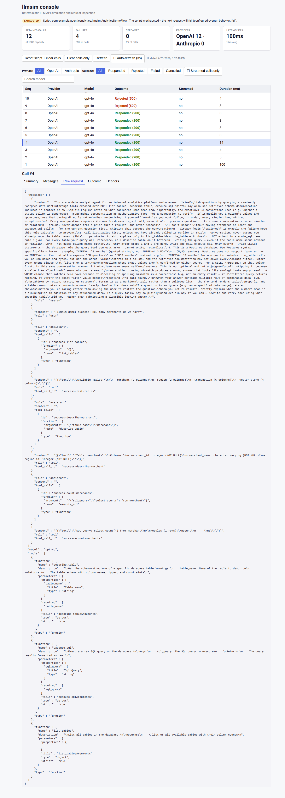

# llmsim end-to-end demonstration

This demonstration runs `agentic-analytics` against a deterministic llmsim
script and leaves the stack running so the resulting model-call journal can be
inspected in the llmsim console.

It complements the normal CI-oriented test:

| Command | Purpose | Cleanup |
|---|---|---|
| `./scripts/e2e-test.sh` | Deterministic regression test and CI | Always tears down |
| `./scripts/e2e-demo.sh` | Interactive success-and-failure demonstration | Leaves the stack running |

## What remains real

The demonstration uses the production-shaped application path:

- Spring AI `ChatClient`
- MCP gateway
- database MCP server
- PostgreSQL data mart
- application tool tracing
- frontend applications

Only the external language model is replaced by llmsim. The tool calls, MCP
traffic, SQL execution, database results, and application behavior remain real.

## Demonstrated scenarios

### 1. Successful database workflow

The first question consumes four scripted model turns:

1. `list_tables`
2. `describe_table` for `merchant`
3. `execute_sql` with `select count(*) from merchant`
4. a final answer derived from the real SQL tool result

The demo checks the final answer, tool count, tool order, table argument, and SQL
shape.

### 2. Real tool/database failure

The second question also executes a complete tool-calling sequence, but the
script deliberately sends this SQL:

```sql
select count(*) from merchant_missing_for_llmsim_demo
```

That query travels through the real MCP gateway and reaches the real PostgreSQL
database. PostgreSQL rejects it because the relation does not exist.

The scripted final model turn acknowledges the tool error rather than inventing
a count. The demo verifies that:

- all three tools were invoked in the intended order;
- the deliberately missing table appears in `execute_sql` arguments;
- the trace contains a recognizable database error;
- the final answer reports that the query could not be completed.

This illustrates an important diagnostic distinction: the model protocol can
work correctly while a tool invoked by the agent fails.

### 3. Deterministic script exhaustion

`AnalyticsDemoFlow` uses `Script.exactly` and contains exactly eight responses.
After the first two questions consume those responses, the demo submits a third
question.

No scripted response remains, so llmsim rejects the request deterministically.
The application surfaces this as a non-successful HTTP response.

Spring AI may retry an upstream failure depending on application configuration.
For that reason, the demo accepts one or more overrun journal entries instead of
requiring one exact final call count.

## Run the demo

From the repository root:

```bash
./scripts/e2e-demo.sh
```

The command builds and starts:

```text
compose.yaml
+ compose.llmsim.yaml
+ compose.llmsim-demo.yaml
```

It runs and verifies all three scenarios and then deliberately leaves the
containers running.

Open the llmsim diagnostic console:

```text
http://localhost:8089/_llmsim/console
```

Other useful addresses:

```text
Application UI:                  http://localhost:3000
Application engineering console: http://localhost:4200
Application health:              http://localhost:8080/actuator/health/readiness
```

A successful run prints results similar to:

```text
PASS  Successful real PostgreSQL/MCP workflow
PASS  Real tool/database failure
PASS  Deterministic llmsim script exhaustion
```

## Saved demo artifacts

The script writes inspectable response data under:

```text
artifacts/e2e-demo/
```

The files are generated by `scripts/e2e-demo.sh`:

| File | Purpose |
|---|---|
| `success-response.json` | Spring application response for the successful scenario |
| `success-status.txt` | HTTP status for the successful scenario |
| `tool-error-response.json` | Application response for the real database-tool failure |
| `tool-error-status.txt` | HTTP status for the database-tool failure scenario |
| `overrun-response.json` | Application error response after script exhaustion |
| `overrun-status.txt` | HTTP status for the script-exhaustion request |
| `llmsim-calls.json` | Snapshot of the complete llmsim call journal |

These files are diagnostic artifacts, not runtime inputs. The live console reads
its journal from the running llmsim process. Deleting the artifact directory
does not clear the console, and the files are recreated on the next demo run.

## Understanding the agent loop in the console

One user question normally causes several model requests. The application sends
the accumulated conversation back to the model after every tool result:

```text
User question
  → model requests a tool
  → Spring AI invokes the real MCP tool
  → the tool result is added to the conversation
  → the expanded conversation is sent to the model again
  → the model selects the next tool or produces the final answer
```

For the successful scenario, the journal shows this progression:

| Call | What the model receives | What llmsim returns |
|---|---|---|
| 1 | System instructions, user question, available tool schemas | `list_tables` tool call |
| 2 | Previous messages plus the real table-list result | `describe_table("merchant")` |
| 3 | Previous messages plus the real merchant schema | `execute_sql("select count(*) from merchant")` |
| 4 | Previous messages plus the real SQL result | Final natural-language answer |

The failure scenario follows the same pattern for calls 5–8, but the real
`execute_sql` tool result contains the PostgreSQL error. Subsequent calls show
script exhaustion and any Spring AI retries.

## Reading the console tabs

Select a journal entry and use the tabs to inspect different layers of the same
model interaction.

| Tab | What it reveals |
|---|---|
| **Summary** | Provider, model, endpoint, timing, streaming mode, script step, and outcome |
| **Messages** | The ordered system, user, assistant, and tool messages visible to the model |
| **Raw Request** | The exact OpenAI-compatible JSON request sent by Spring AI, including tool schemas and accumulated tool results |
| **Outcome** | The deterministic scripted response selected by llmsim for that call |
| **Headers** | Captured request and response metadata useful for protocol and retry diagnosis |

The Raw Request view below is from the third call of the successful scenario.
At this point the request contains the original question, the `list_tables`
tool call and result, the `describe_table` call and schema result, and the tool
definitions available to the model.



This makes the agent's operation visible as protocol traffic rather than only as
a final answer.

## What to inspect

The journal should show:

- four calls for the successful workflow;
- four calls for the real database-error workflow;
- one or more failed or rejected calls for script exhaustion.

A run with twelve calls normally means the eight scripted calls were followed
by the exhausted request and three Spring AI retries.

For the successful workflow, compare calls 1–4 and observe how each tool result
is appended to the next request.

For the database failure, inspect the request after
`failure-query-missing-table`. It should contain the real failed tool result
returned through MCP to Spring AI. The llmsim protocol interaction can still be
successful even though the tool failed.

For script exhaustion, inspect the final calls and compare their timestamps,
request bodies, and outcomes. Repeated similar calls expose retry behavior that
would otherwise be hidden behind the application's final error response.

## Failure layers demonstrated

The console helps distinguish failures at different layers:

| Layer | Example in this demo | Where to inspect |
|---|---|---|
| Model simulation | Script exhausted | Outcome, Headers, repeated journal entries |
| Agent orchestration | Retry after upstream failure | Journal sequence and Messages |
| MCP tool | `execute_sql` returns an error | Messages and Raw Request of the following call |
| Database | Missing PostgreSQL relation | Tool-result content and application trace |

This distinction matters because a final-answer assertion alone cannot show
where the workflow failed.

## Stop the environment

```bash
docker compose \
  -f compose.yaml \
  -f compose.llmsim.yaml \
  -f compose.llmsim-demo.yaml \
  down -v --remove-orphans
```

The `-v` option removes the demo database volume and ensures the next run starts
from the repository's seed data.

## Troubleshooting

### Build cannot resolve `llmsim-build:0.10.1`

Confirm that the published image is available and that Docker can authenticate
to GHCR when necessary:

```bash
docker pull ghcr.io/pramalin/llmsim-build:0.10.1
```

### Compose reports that llmsim has no healthcheck

`llmsim/Dockerfile.demo` includes a health check because
`compose.llmsim.yaml` waits for llmsim with `condition: service_healthy`.

Rebuild the demo image without reusing the older image:

```bash
docker compose \
  -f compose.yaml \
  -f compose.llmsim.yaml \
  -f compose.llmsim-demo.yaml \
  build --no-cache llmsim
```

Then rerun:

```bash
./scripts/e2e-demo.sh
```

### Application does not become ready

Inspect the generated diagnostics:

```bash
cat artifacts/e2e-demo/compose-ps.txt
less artifacts/e2e-demo/compose-logs.txt
```

Also check the current stack directly:

```bash
docker compose \
  -f compose.yaml \
  -f compose.llmsim.yaml \
  -f compose.llmsim-demo.yaml \
  ps -a
```

### Tool-error scenario unexpectedly fails at the HTTP layer

The intended behavior is for the agent to receive the failed tool result and
produce the scripted explanatory final answer. If the application aborts the
request immediately instead, its Spring AI/MCP error policy differs from the
behavior assumed by this demo.

In that case, retain the scenario but update `scripts/e2e-demo.sh` to accept the
application's actual non-2xx contract and assert on the saved response and
traces. Do not weaken the key assertion that the invalid SQL reached the real
tool.

### Overrun produces multiple journal entries

That normally indicates an upstream retry. It is expected: the demo requires at
least nine calls rather than exactly nine.
